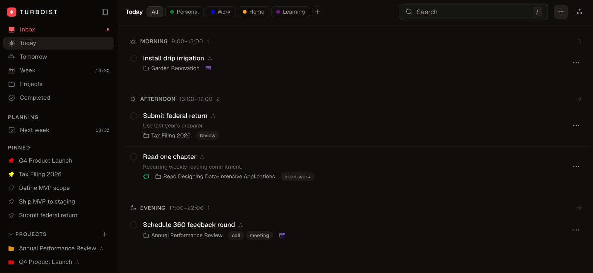

# Turboist

Turboist is a task management app for the rest of us.



## Features

- Contexts, projects, sections, labels (with auto-label rules)
- Mask-based project suggestions on task creation (up to 3, A-Z)
- Inbox with overflow handling
- Day phases (morning / day / evening / anytime)
- Weekly / backlog planning with per-bucket caps
- Pinned tasks and pinned projects (separate caps)
- Recurring tasks (RRULE, advanced on completion)
- Task relations — `related` cross-references plus `blocks` dependencies that prevent completing a blocked task — [docs/task-relations.md](docs/task-relations.md)
- Single-user JWT auth with refresh-token rotation
- Optional TOTP 2FA (RFC 6238) with single-use recovery codes
- [Troiki System](docs/troiki-system.md)
- Localized UI (English / Russian) — [docs/locales.md](docs/locales.md)
- Public View — [docs/public-mode.md](docs/public-mode.md)
- Google Calendar integration (read-only) — [docs/google-calendar.md](docs/google-calendar.md)
- Native iOS & Android apps (Capacitor) — [docs/mobile.md](docs/mobile.md)
- Offline support — read cached screens plus queued task complete/uncomplete/inbox-add — [docs/offline.md](docs/offline.md)
- [Public API](API.md)

## Quick start

```sh
cp .env.example .env           # fill JWT_SECRET, API_TOKEN_SALT, BASE_URL
cp config.example.yml config.yml
docker compose up -d
```

See [docs/configuration.md](docs/configuration.md) for all environment variables and config options.

## Docs

- [Installation](docs/install.md) — nginx config
- [Upgrading](docs/upgrade.md) — how to update to a new version
- [Configuration](docs/configuration.md) — env vars, log levels, config.yml
- [Backend architecture](docs/architecture/backend.md) — endpoints, auth, storage, dev commands
- [API reference](API.md)
- [Task relations](docs/task-relations.md) — `related` / `blocks`, and how blocking works
- [Troiki System](docs/troiki-system.md)
- [Localization](docs/locales.md)
- [Public mode](docs/public-mode.md)
- [Google Calendar](docs/google-calendar.md)
- [Mobile apps (iOS & Android)](docs/mobile.md)
- [Offline support](docs/offline.md)

## RoadMap

- Feature: Constraints

## License

[MIT](LICENSE.md)
